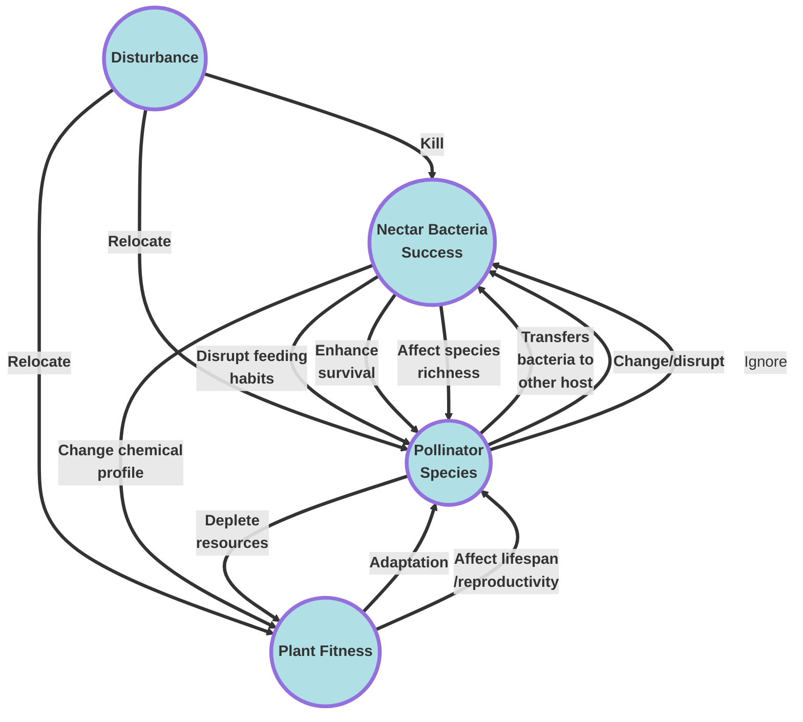
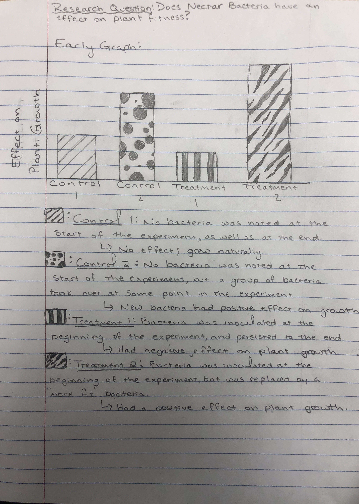

##Homework 2 

### **Raymond Looney.** 					**January 24th, 2018**

### A.) Cause and effect diagram between nectar bacteria success, pollinator species, and plant fitness. 

### B.) Early Graph 

